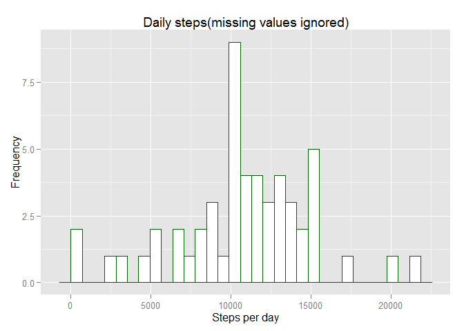
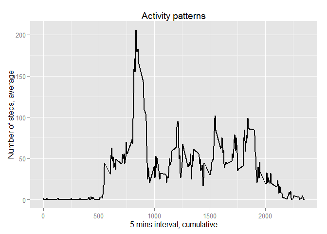
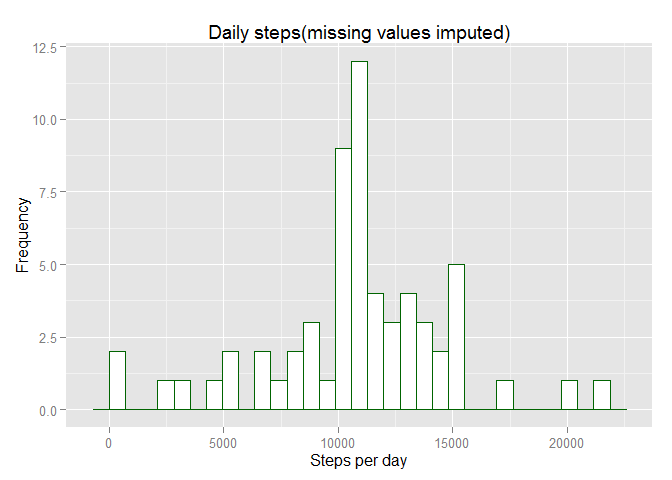
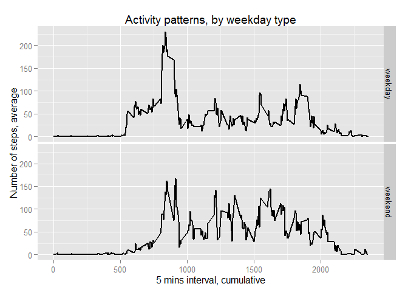

# Reproducible Research: Peer Assessment 1


###Preparation stage
Lets set global options and load libraries required


```r
#load all libraries required
library("knitr")
library("dplyr")
library("ggplot2")

#options change to fix intline code issues(incorrect digits length)
options(scipen=999)

#hide system messages
opts_chunk$set(message = FALSE,warning=FALSE,echo = TRUE)
```

###Step 0, Loading and preprocessing the data

Download and unzip data

```r
#download and unzip data
url<-"http://d396qusza40orc.cloudfront.net/repdata%2Fdata%2Factivity.zip"
download.file(url,"ass1_activity.zip")
unzip("ass1_activity.zip")
```

Read data into data frame and convert date fields into Date class

```r
#read data into R data frame
df<-read.csv("activity.csv")

#convert "date" field to date class
df$date = as.Date(df$date,'%Y-%m-%d')
```

###Step 1, What is mean total number of steps taken per day?

Plot bellow demonstrates distribution of steps sum aggregated by days. NA values were ignored(i.e. remain present in the sample) 
as was proposed in assignment description


```r
##-->stage1<---What is mean total number of steps taken per day?
#calculate steps sum grouped by date
df_st1<-df %>% group_by(date) %>% summarize(sumByDate=sum(steps))

#build histogram for grouped sum
g <- ggplot(df_st1, aes(x = sumByDate))
g + geom_histogram(colour = "darkgreen",fill = "white")+
        labs(title = "Daily steps(missing values ignored)")+
        labs(x = "Steps per day")+
        labs(y = "Frequency")
```

 

So precise mean and median for this distribution as follows:  
**median** = *10765*    
**mean** = *10766.19*


###Step 2, What is the average daily activity pattern?

This time to answer the question we will build time series plot for mean of steps(y-axis) grouped by 5 minutes time intervals(x-axis):


```r
##-->stage2<---What is the average daily activity pattern?
#calculate mean steps grouped by interval
df_st2<-df %>% group_by(interval) %>% summarize(meanSteps=round(mean(steps,na.rm = T)))

#build histogram for grouped and rounded mean
g<-ggplot(df_st2,aes(y=meanSteps,x=interval))
g + geom_line(size = 1) +
        labs(title = "Activity patterns")+
        labs(x = "5 mins interval, cumulative")+
        labs(y = "Number of steps, average")
```

 

The 5-minutes interval that contains maximum number of steps is:  
**max steps 5-interval** = *835*


###Step 3, Imputing missing values

For step 3 we repeat step 1 analysis, but this time missing steps(NA) will be replaced with someting more appropriate.
For now sample includes *2304* **missing values**.
Lets fill those with mean variables, so that for each missing step we will impute its mean from the corresponding time interval(i.e empty step 
for interval "5" replaced by mean of all steps in interval "5", repeating the same with other intervals)

```r
##-->stage2<---Imputing missing values
#create data with mean grouped by intervals and rounded to whole nums. Next replace all NA steps with corresponding mean
df_by_interval<-df %>% group_by(interval) %>% summarize(meanByInterval=round(mean(steps,na.rm = T)))
df[!complete.cases(df),"steps"]<-
        left_join(df[!complete.cases(df),],df_by_interval,by="interval")$meanByInterval
```

NAs are replaced. New plot:

```r
df_st3<-df %>% group_by(date) %>% summarize(sumByDate=sum(steps))
g <- ggplot(df_st3, aes(x = sumByDate))
g + geom_histogram(colour = "darkgreen",fill = "white")+
        labs(title = "Daily steps(missing values imputed)")+
        labs(x = "Steps per day")+
        labs(y = "Frequency")
```

 

So new median and mean are:  
**Median** = *10762*  
**Mean** = *10765.64*  
Both values remains almost the same as before imputing.  
median(NA free)-median(NA) = *-3*  
mean(NA free)-mean(NA) = *-0.55*

###Step 4, Are there differences in activity patterns between weekdays and weekends?

Plot bellow describes how activity during weekends differs comparing to the rest of weekdays

```r
##-->stage4<---Are there differences in activity patterns between weekdays and weekends?
#add new field to define separation by weekends and weekdays
df<-mutate(df,weekday_type=ifelse(weekdays(date) %in% c("Sunday","Saturday"),"weekend","weekday"))

#calculate steps mean grouped by interval and weekday type, build time-series plot divided by weekday type
df_st4<-df %>% group_by(interval,weekday_type) %>% summarize(meanSteps=round(mean(steps)))
g<-ggplot(df_st4,aes(y=meanSteps,x=interval))
g+geom_line(size =1) + facet_grid(weekday_type~.)+
        labs(title = "Activity patterns, by weekday type")+
        labs(x = "5 mins interval, cumulative")+
        labs(y = "Number of steps, average")
```

 
